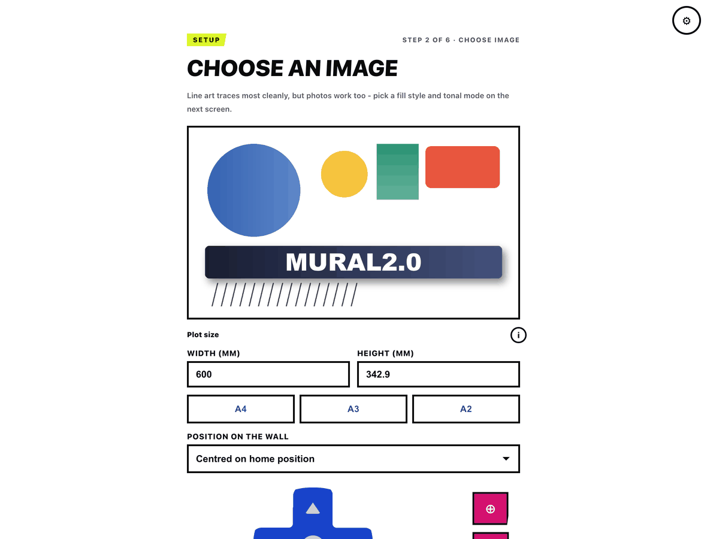
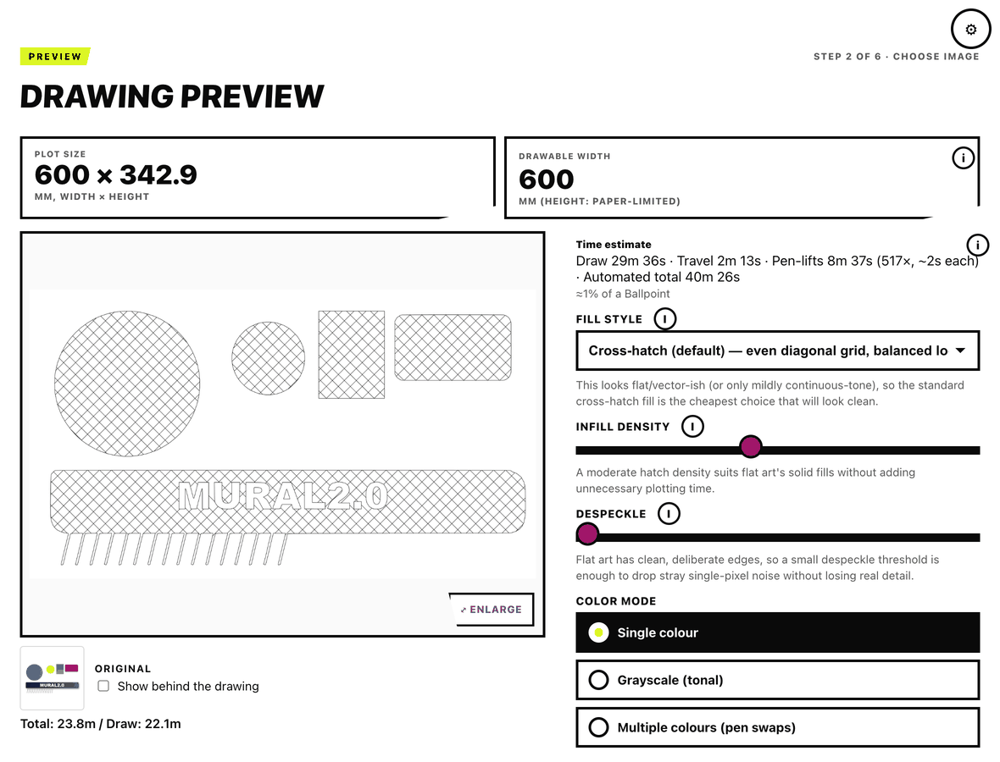
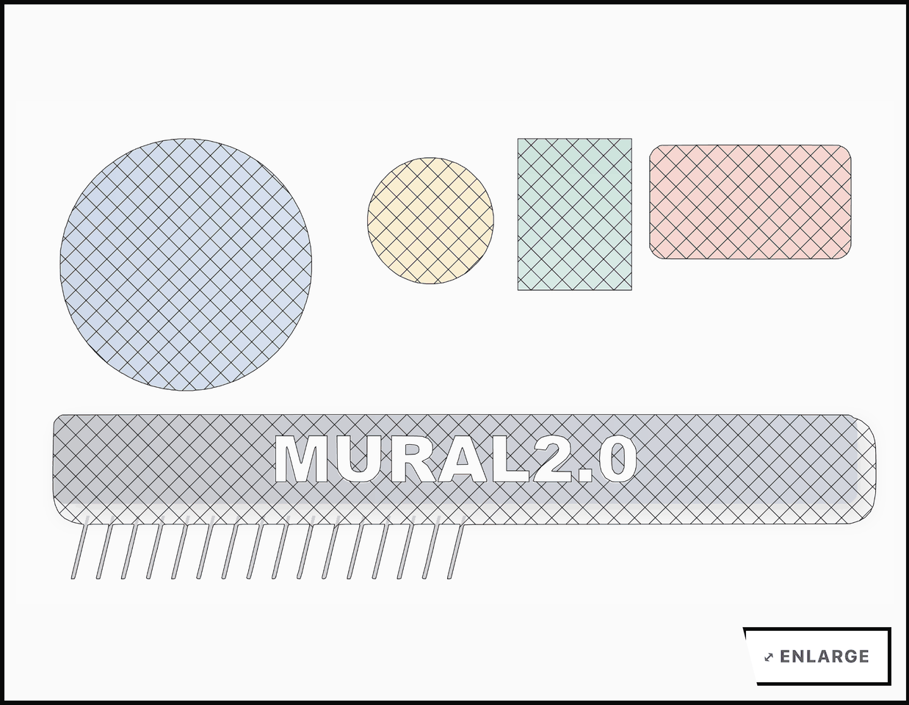
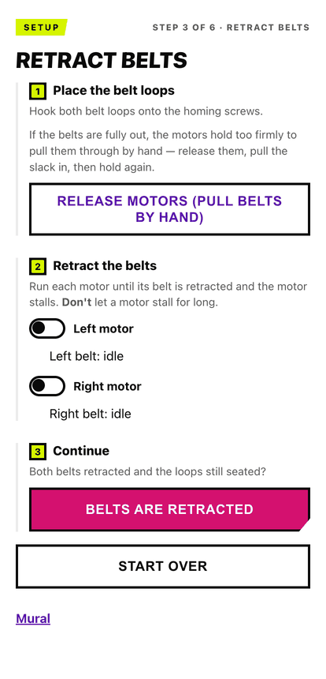
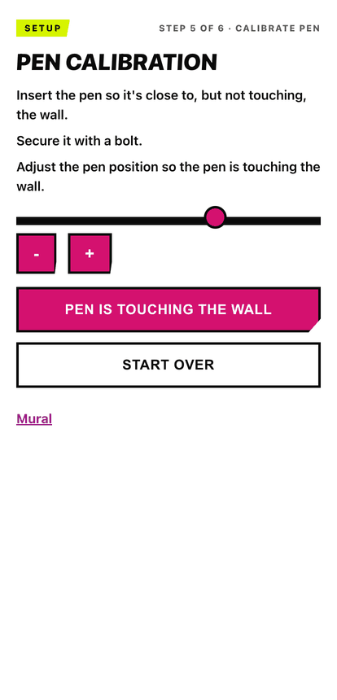

# Mural 2.0

**An enthusiastic fork of [Mural](https://getmural.me)** — the belt-driven robot
that hangs off two nails and draws on your wall.

The original hardware and firmware are excellent, and this fork changes neither
in any way you'd notice. What it adds is colour, better mark-making, and an
interface that tells you what's about to happen before it happens.

> ### ⚠️ Partly proven on paper
>
> This runs on a real machine: firmware flashed over USB and over the air, belts
> homed, images plotted end to end. What hasn't had a full shakedown is most of
> the mark-making — the galleries are rendered from the actual command files the
> machine executes, so the geometry is what the pen will follow, but only a
> couple of the fill styles have been drawn with an actual pen.
>
> 233 automated tests, five firmware build configurations, and a mock-firmware
> harness that runs the whole web UI with no machine attached
> (`node tools/mock_firmware.js`).

---

## How it works

### 1. Choose an image

Drop in an SVG, or a photo — JPEG, PNG or WebP. Set the size you actually want
in millimetres (or pick A4/A3/A2), nudge and zoom to frame it, and choose where
on the wall it lands.



### 2. Tune the drawing, and see what you're in for

Pick a fill style and a colour mode, and the preview shows the strokes the pen
will make — not a filter, the real command file rendered back. Before you
commit, it tells you how long the machine will take, how many pen lifts that
includes, and roughly how much of a Sharpie it will use.



Settings changes don't silently re-render — the preview is marked out of date
and you choose when to redo it, because a dense render on a phone takes real
time.

The original sits under the preview so you don't lose track of it, and can be
laid **behind** the drawing to see how faithfully each part was traced:



More on fill styles, tonal shading and pen swaps: **[docs/mark-making.md](docs/mark-making.md)**.

### 3. Set the machine up

Each step is one instruction, numbered, with a way out. The belts can be
released so you can pull them through by hand rather than jogging the full
length at motor speed.

<p>

&nbsp;

</p>

### 4. Draw

Live progress streamed from the machine, as elapsed plotting time rather than
lines of a file, with the current position and a pause button that stops at the
end of the stroke rather than mid-line.


If the power goes out, it offers to resume: it checkpoints position and pen
state as it draws, re-homes against the stop screws, travels back pen-up, and
only then puts the pen down.

---

## What this fork adds

**Colour.** Multi-colour drawing with pen swaps, layers drawn light to dark, a
trapping gap so two pens never touch, and hue grouping so a two-blue image needs
one blue pen at two hatch densities rather than two pens.
→ [docs/mark-making.md](docs/mark-making.md), [docs/multi-color.md](docs/multi-color.md)

**Seven fill styles** instead of one — cross-hatch, single-direction, angled,
jittered, spiral, contour, and a gradient hatch that follows the image's own
shading like an engraving. → [docs/mark-making.md](docs/mark-making.md)

**Photographs**, traced directly rather than via a vector detour.

**Estimates before you commit** — plot time derived from the real command file
including the ~2 seconds every pen lift costs, ink measured in Sharpies, and a
processing-time estimate calibrated against your own device.

**A UI that survives contact.** Every setup screen has a way out, a finished
plot has somewhere to go, a stall is recoverable, and there's a cancel button.
It works on a phone, and it needs no internet: nothing is fetched from a CDN,
and the build refuses to produce a filesystem image that would need one.

**Resume after a power cut**, pen-up travel at full speed, redrawable command
files, and a pen that lifts within a second of power-on so it isn't dragged
across the paper while the WiFi connects.

**Diagnostics that tell you what's wrong** — signal strength, reconnect count,
free heap, uptime, transmit power and the reason for the last restart, all in
the state document, because "it won't load" needed to be answerable with
numbers.

## How a drawing is positioned

- You enter the **pin distance** during setup — the distance between the two nails. Say 1000mm.
- There's a **20% margin** on the top and both sides, so the drawable area is **60% of the pin distance** wide: 600mm in this example. The top of the image sits 200mm below the line between the pins.
- By default the image fills that width and the height follows its aspect ratio. You can instead **set a target width or height in millimetres**, and the scale is derived from it.
- Each SVG unit is treated as one millimetre.
- The result is compiled to a simple command file — coordinates, pen up, pen down — which is uploaded to the microcontroller and executed line by line.


---

## Documentation

| | |
|---|---|
| [Mark-making](docs/mark-making.md) | Fill styles, tonal levels and pen swaps, with pictures |
| [Multi-colour](docs/multi-color.md) | How colour separation, layer ordering and pen swaps work |
| [Motion smoothing](docs/motion-smoothing.md) | `MURAL_SMOOTH_MOTION`: merging near-collinear waypoints |
| [Pen servo](docs/pen-servo.md) | Pen geometry and the three calibrated angles |
| [TMC UART](docs/tmc-uart.md) | Optional TMC2209 UART build, including stall detection |
| [Kinematic model](KinematicModel.md) | The belt geometry the firmware solves |
| [BOM](BOM.md) | What the machine is made of |

## Tools

```bash
node tools/mock_firmware.js          # the whole web UI, no machine attached
node tools/mock_contract_test.js     # fails if the mock drifts from the firmware
node tools/make_style_examples.js    # regenerate the mark-making gallery
node tools/make_screenshots.js       # regenerate the screenshots above
python3 tools/check_offline.py       # fails if the UI would need the internet
python3 tools/check_sizes.py         # flash budget gates
```

## Optional, off by default, and definitely untested

Two features are compiled out unless you ask for them, because neither has run on real hardware and one needs wiring the original build doesn't have:

| Flag | What it does | Needs |
|---|---|---|
| `MURAL_TMC_UART` | Sensorless stall detection — auto-retract during belt homing, and pausing if the machine stalls mid-draw | Extra wiring: a shared UART line to both stepper drivers plus DIAG pins. See [docs/tmc-uart.md](docs/tmc-uart.md) |
| `MURAL_SMOOTH_MOTION` | Carries velocity through near-collinear moves instead of stopping at every 1mm step | Nothing, but unproven. See [docs/motion-smoothing.md](docs/motion-smoothing.md) |

Build them with `pio run -e esp32dev-tmcuart` or `-e esp32dev-smooth`. The default `esp32dev` build behaves exactly as the original hardware expects.

> **Reflashing repartitions the device.** The app partition grew (1600K app / 2400K filesystem) to fit the larger firmware. The first flash with the new table wipes stored files and saved settings, so you'll re-run setup once.

---

## Credits

None of this would exist without the original Mural — excellent code and genuinely lovely hardware, neither of which needed changing to build on. This fork owes it everything.

It also owes something to previous adventures with Lego Mindstorms wall plotters and a hack of the Makelangelo, and to careful but generous application of Claude Code in pursuit of the greater good.
