# Mural 2.0

**An enthusiastic fork of [Mural](https://getmural.me)** — the belt-driven robot that hangs off two nails and draws.

The original hardware and firmware are excellent and this fork changes neither in any way you'd notice. What it adds is colour, better mark-making, and a UI that tells you what's about to happen before it happens.

> ### ⚠️ Partly proven on paper
>
> This now runs on a real machine: firmware flashed over USB and over the air,
> belts homed, and images plotted end to end on paper. What has *not* been
> through a full shakedown is most of the mark-making — the gallery below is
> rendered from the actual command files the machine executes, so the geometry
> is what the pen will follow, but only a couple of these styles have been drawn
> with an actual pen. Treat stroke counts and ink lengths as measured, and
> "looks good" as provisional.
>
> Backing it up: 232 automated tests, five firmware build configurations, and a
> mock-firmware harness that runs the whole web UI without a machine attached
> (`node tools/mock_firmware.js`).

---

## What's new

### Colour

- **Multi-colour drawing with pen swaps.** The machine draws every region of one colour, parks, prompts you to swap pens, and carries on. Pen-length differs between pens, so it re-runs pen calibration on each swap.
- **Layers are drawn light to dark**, so where two colours meet it's the darker nib that crosses the lighter ink — the direction you can't see. 
- **A trapping gap** (borrowed from print) insets each knockout by about a nib width, leaving a hairline of bare paper between colours so the two pens never actually touch. Set it to 0 for the old touching behaviour.
- **Shades from one pen.** Hue-grouped shading collapses similar hues onto a single pen and renders the lighter shades as sparser hatching, so a two-blue image needs one blue pen, not two. Spacing is derived from the *measured* tone gap between the shade and its pen, not from its rank in a list.
- **Per-layer enable/disable.** Turn off any colour you don't own a pen for — or that isn't worth drawing. A near-white background layer on one test image was 35% of the total plot time and invisible on white paper.

### Mark-making

**Seven fill styles** — the original cross-hatch plus six new ones. Every picture
below is drawn from the real command file the machine would execute, by
`tools/make_style_examples.js`, so the strokes are the strokes the pen makes.

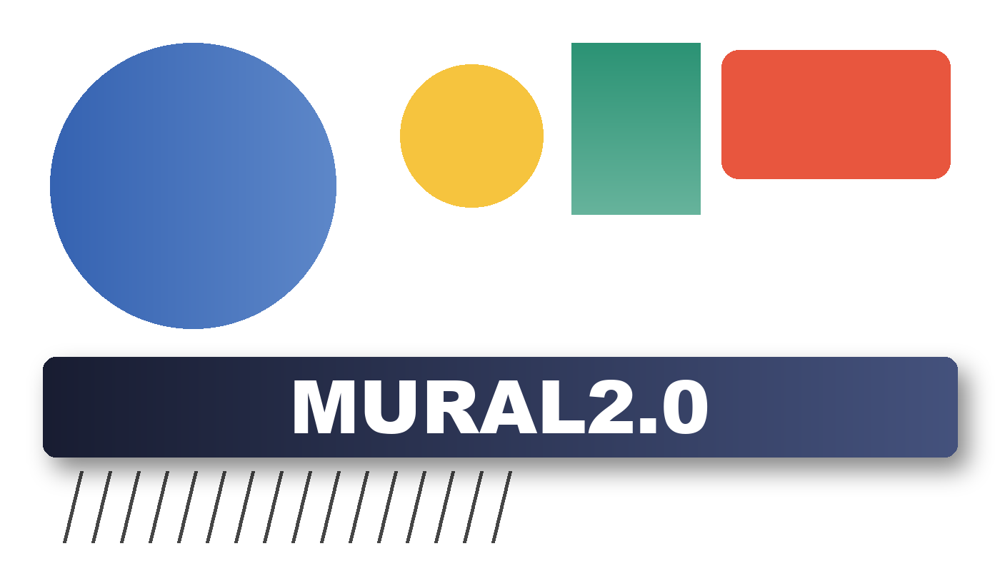

*The test image: a smooth gradient, flat colour, a second ramp at another angle,
thin line work, and a wordmark knocked out of a shadowed band. All 400 × 229 mm,
infill density 3, so the numbers are comparable.*

| | | |
|---|---|---|
| 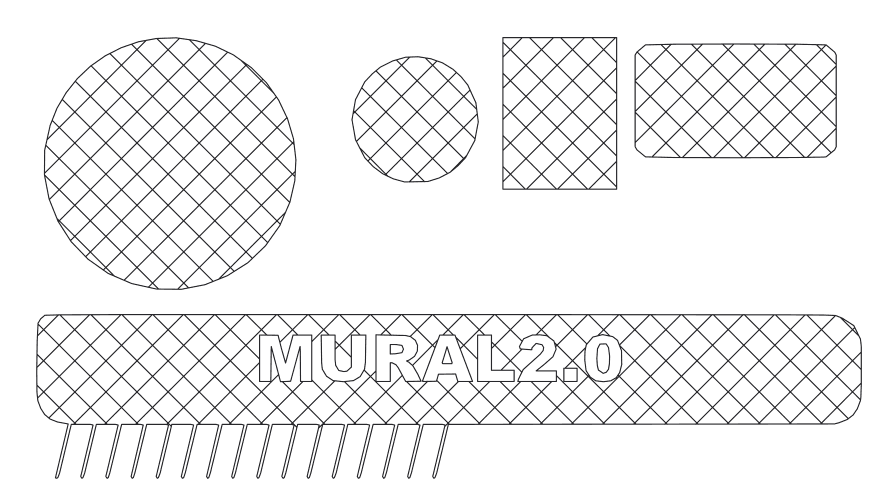<br>**Cross-hatch** (default)<br><sub>Even 45° grid · 174 strokes · 10.9 m</sub> | 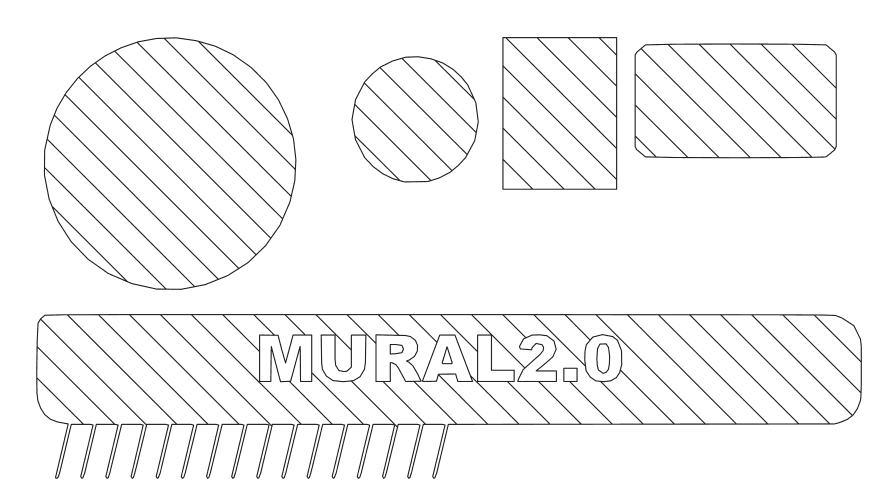<br>**Single-direction**<br><sub>One diagonal, ~⅔ the ink · 90 strokes · 7.1 m</sub> | 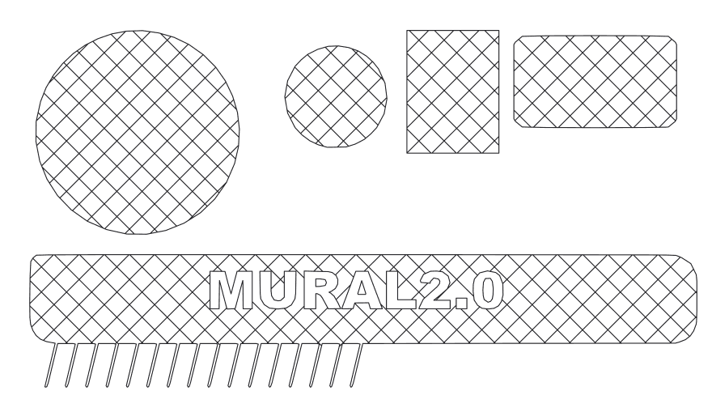<br>**Angled cross-hatch**<br><sub>Any angle; colour layers each get their own · 169 strokes · 10.8 m</sub> |
| <br>**Jittered**<br><sub>Hand-drawn wobble · 170 strokes · 10.8 m</sub> | 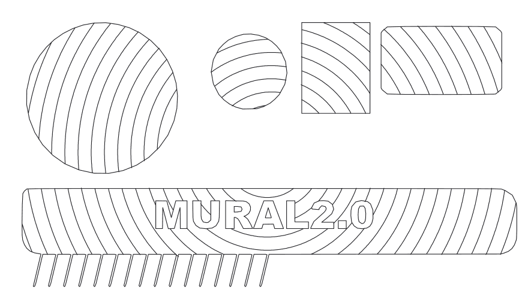<br>**Spiral**<br><sub>One continuous stroke per region · 91 strokes · 7.1 m</sub> | 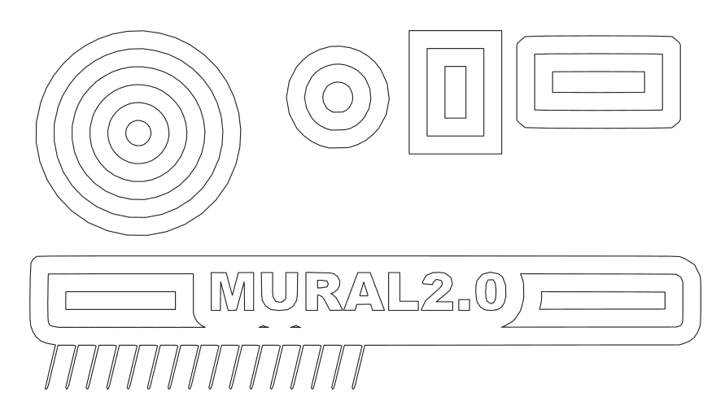<br>**Contour**<br><sub>Rings following the shape's own outline · 33 strokes · 5.9 m</sub> |
| 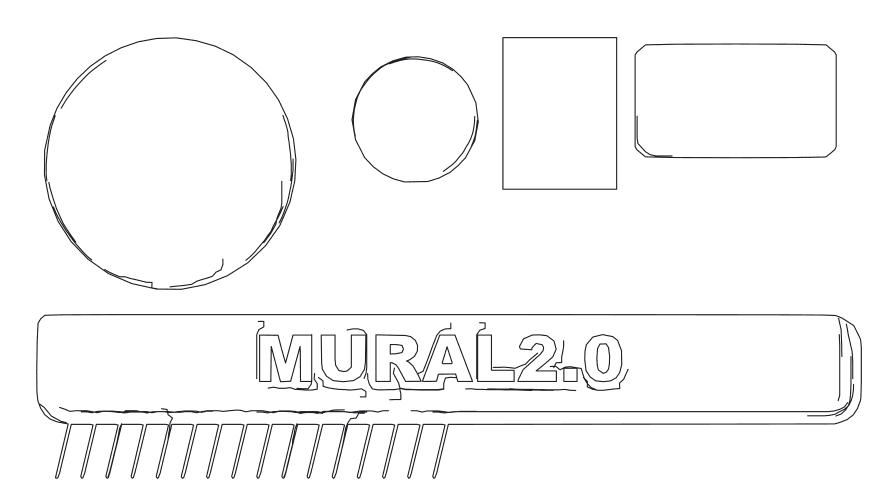<br>**Gradient hatch**<br><sub>Follows the image's shading · 79 strokes · 5.6 m</sub> | | |

Note how thin gradient hatch looks here: it only marks where the image actually
has shading to follow, and most of this test image is flat colour. Give it
something with tone and it behaves completely differently.

### The right style for the subject

**Gradient hatch** wants continuous tone. On a shaded painting it stops being a
fill and starts being an engraving — the strokes follow the muscle rather than
crossing it, for *less* ink than the flat grid:

| | |
|---|---|
| <br><sub>Cross-hatch · 177 strokes · 11.3 m</sub> | 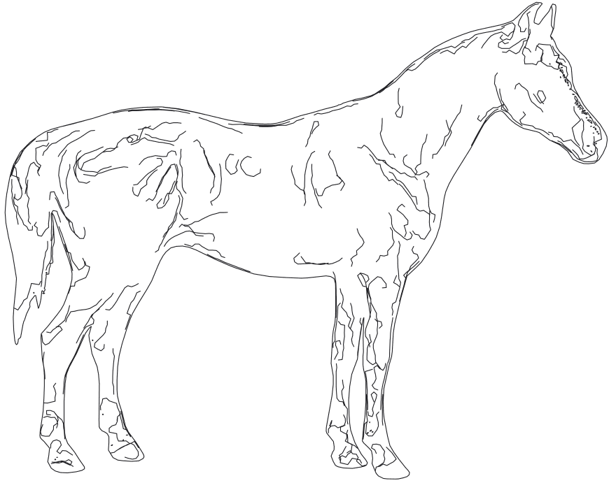<br><sub>Gradient hatch · 230 strokes · 7.6 m</sub> |

**Contour and spiral** want flat, clean-edged shapes, where following the outline
means something:

| | |
|---|---|
| 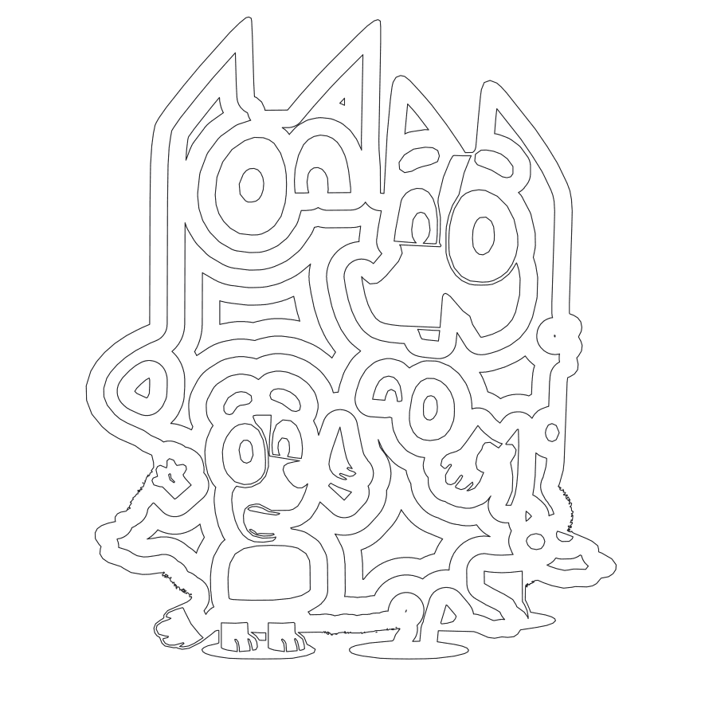<br><sub>Contour · 79 strokes · 9.4 m</sub> | 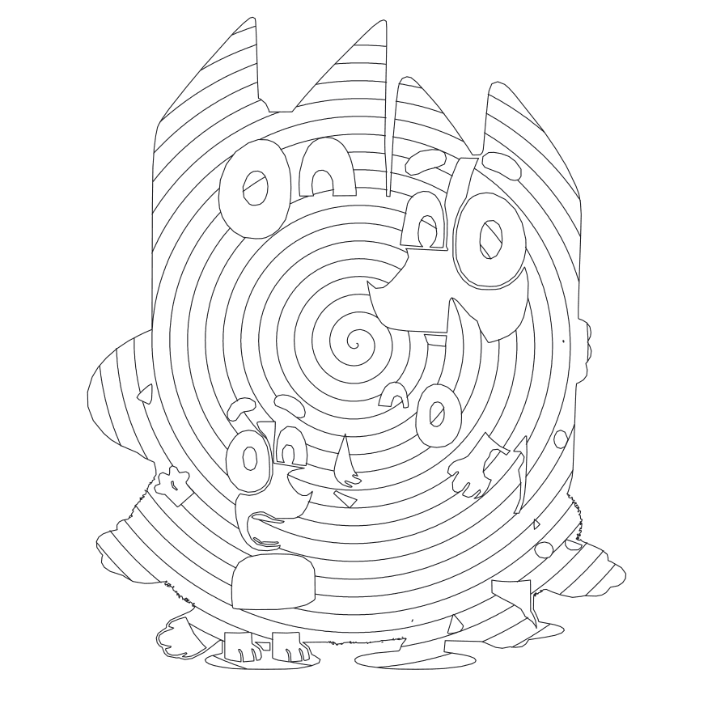<br><sub>Spiral · 166 strokes · 11.3 m</sub> |

### Tone and colour

**Grayscale (tonal)** traces nested luminance bands and hatches each at its own
density, so one pen renders shading. More levels means more separation and more
time:

| | | |
|---|---|---|
| 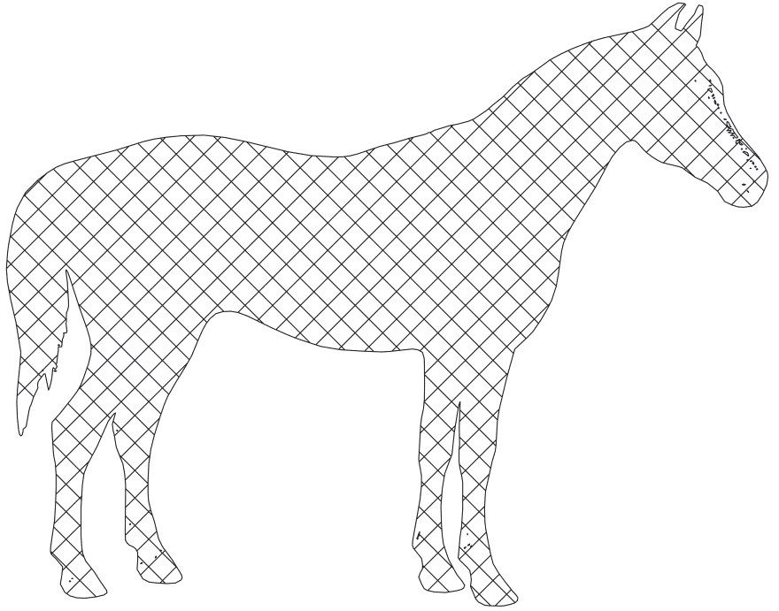<br><sub>Single colour · 177 strokes · 11.3 m</sub> | 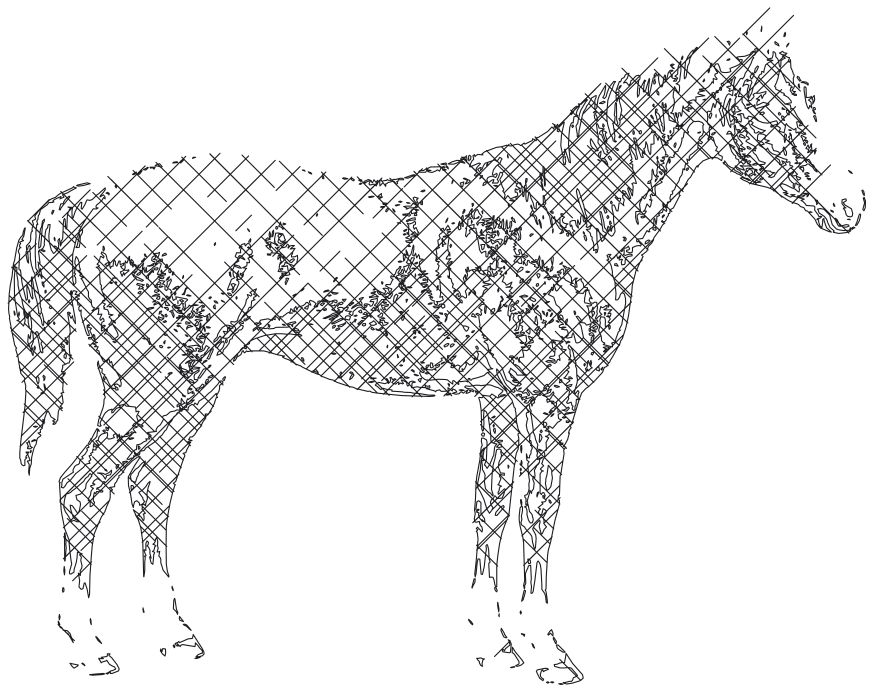<br><sub>3 levels · 2,626 strokes · 30.3 m</sub> | 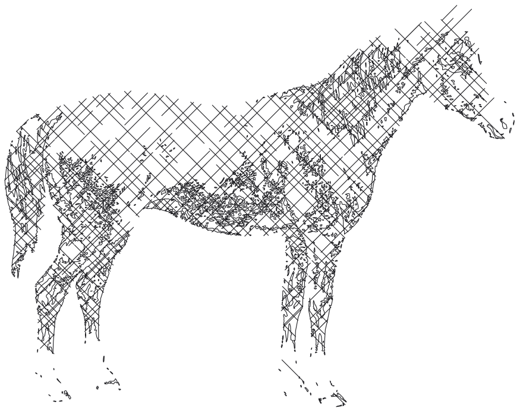<br><sub>4 levels · 2,876 strokes · 31.7 m</sub> |

**Multi-colour** separates the image into one mask per pen and stops for a swap
between them. It suits flat artwork, which is what k-means quantisation is good
at.

Every extra pen is a pen you have to own and a swap you have to stand around
for, so **hue grouping** is usually the setting you want: similar hues collapse
onto one pen, and the lighter shades of that hue are drawn as sparser hatching
instead of as separate inks. Two blues become one blue pen at two densities.

| | |
|---|---|
| 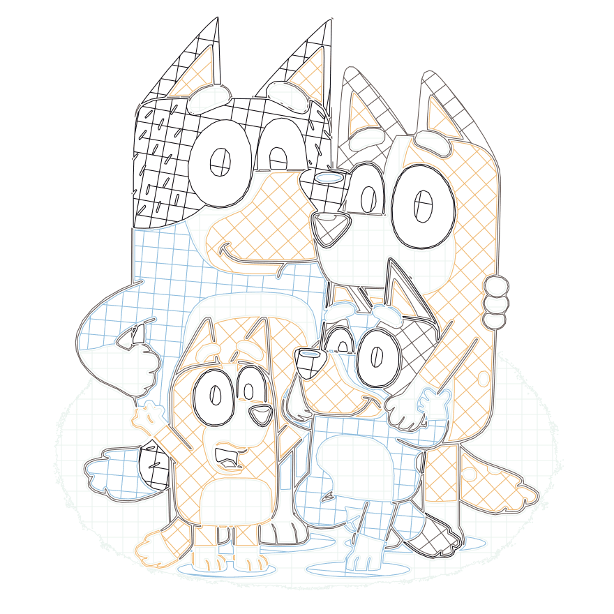<br><sub>**5 pens, no grouping** · 1,050 strokes · 32.5 m</sub> | 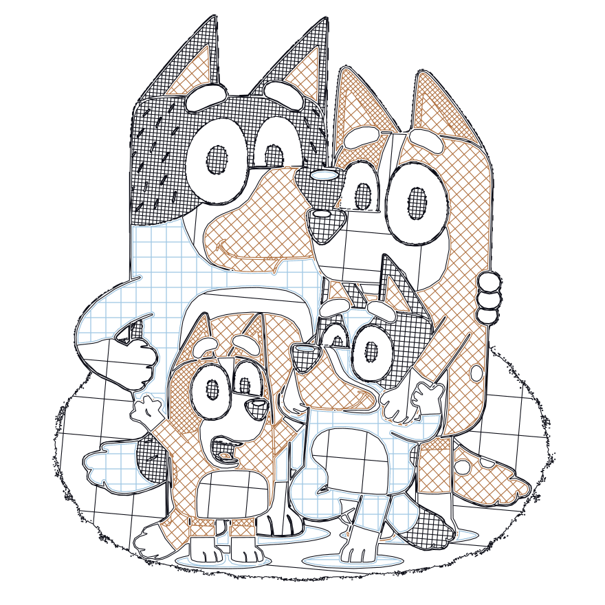<br><sub>**6 colours detected → 3 pens** · 2,913 strokes · 48.7 m</sub> |

Three pens carry it: one blue, one orange, one near-black. The tonal separation
that five pens spent ink on is done with hatch density instead — which is why
the grouped version reads more strongly despite using fewer inks. It costs more
ink and time, because rendering a tint as hatching means actually drawing it
rather than swapping to a paler pen.

A caveat worth knowing before you try it on the wrong thing: run colour
separation over a *gradient*-heavy image and pale regions tend to get quantised
into near-white palette entries and dropped. The wordmark image above loses its
blue disc and green ramp entirely at five pens. Flat art separates cleanly;
airbrushed art does not.

Regenerate any of these with:

```bash
node tools/make_style_examples.js                      # every style, test image
node tools/make_style_examples.js --mode grayscale --levels 4 --image path/to.jpg
node tools/make_style_examples.js --mode color --colors 5 --image path/to.png
node tools/make_style_examples.js --mode color --colors 6 --hue-grouping --image path/to.png
```

The density ladder now reaches 2.5mm spacing (was 7mm), which is what makes true mid-tones possible rather than only light tints.

### Knowing what you're in for

- **Estimates before you commit**: how long the machine will take to draw the image, and roughly how much pen you'll use — measured in Sharpies. Drawing time is derived from the real command file, including the ~2 seconds every pen lift costs, and is accurate.
- **A rough processing-time estimate too**, calibrated against *your* device so a phone and a desktop give different answers. It's a guide, not a stopwatch: typical renders land within about a factor of two, but some combinations — notably continuous-tone photographs at very sparse infill — are still well under. Use it to tell "a few seconds" from "go and make tea".
- **Plot dimensions in millimetres**, so you can tell whether it fits your paper before you start.
- **Set the size you actually want** — type a target width or height (or pick A4/A3/A2) and the scale is worked out for you, instead of guessing at percentages.
- **Live progress while drawing**, streamed from the machine, with a real ETA.

### Quality-of-life

- **Resume after a power cut.** The machine checkpoints its position and pen state as it draws; on restart it offers to carry on. Because unpowered steppers back-drive, resuming re-homes against the stop screws first, travels back pen-up, and only then puts the pen down.
- **The pen lifts within a second of power-on**, before the WiFi connect, so a pen resting on the paper isn't dragged across it.
- **Pen-up travel runs at full speed** rather than drawing speed.
- **Redrawable command files.** Download the compiled file and re-upload it later to redraw the same image; it records the pin distance it was made for and warns if that's changed.
- **A UI that works on a phone and a desktop** — big touch targets, one instruction per line, and a much larger preview when there's room for it. No CDN dependency, so it works with no internet.

### Under the hood

- **232 automated tests and CI** covering the whole image pipeline, plus flash-budget gates that fail the build if the firmware or filesystem outgrows its partition.
- Better path ordering (both-endpoint greedy plus a bounded 2-opt pass) and polyline simplification, which cut pen-up travel and command-file size.

---

## Optional, off by default, and definitely untested

Two features are compiled out unless you ask for them, because neither has run on real hardware and one needs wiring the original build doesn't have:

| Flag | What it does | Needs |
|---|---|---|
| `MURAL_TMC_UART` | Sensorless stall detection — auto-retract during belt homing, and pausing if the machine stalls mid-draw | Extra wiring: a shared UART line to both stepper drivers plus DIAG pins. See [docs/tmc-uart.md](docs/tmc-uart.md) |
| `MURAL_SMOOTH_MOTION` | Carries velocity through near-collinear moves instead of stopping at every 1mm step | Nothing, but unproven. See [docs/motion-smoothing.md](docs/motion-smoothing.md) |

Build them with `pio run -e esp32dev-tmcuart` or `-e esp32dev-smooth`. The default `esp32dev` build behaves exactly as the original hardware expects.

> **Reflashing repartitions the device.** The app partition grew (1600K app / 2400K filesystem) to fit the larger firmware. The first flash with the new table wipes stored files and saved settings, so you'll re-run setup once.

---

## How a drawing is positioned

- You enter the **pin distance** during setup — the distance between the two nails. Say 1000mm.
- There's a **20% margin** on the top and both sides, so the drawable area is **60% of the pin distance** wide: 600mm in this example. The top of the image sits 200mm below the line between the pins.
- By default the image fills that width and the height follows its aspect ratio. You can instead **set a target width or height in millimetres**, and the scale is derived from it.
- Each SVG unit is treated as one millimetre.
- The result is compiled to a simple command file — coordinates, pen up, pen down — which is uploaded to the microcontroller and executed line by line.


---

## Documentation

| | |
|---|---|
| [Kinematic model](KinematicModel.md) | How belt lengths are derived, including the bot's tilt |
| [Multi-colour design](docs/multi-color.md) | Colour separation, pen swaps, knockout and trapping |
| [TMC2209 UART](docs/tmc-uart.md) | Wiring and bench-testing the optional stall detection |
| [Motion smoothing](docs/motion-smoothing.md) | The optional velocity-carrying motion path |
| [Pen servo PWM](docs/pen-servo.md) | Why the pen drives LEDC directly, and the ESP32Servo double-attach bug it sidesteps |
| [Bill of materials](BOM.md) | Unchanged from the original |
| [Mock firmware harness](tools/mock_firmware.js) | Run the whole web UI with no machine attached, including injected faults |

Original project documentation remains at **[getmural.me](https://getmural.me)**.

---

## Credits

None of this would exist without the original Mural — excellent code and genuinely lovely hardware, neither of which needed changing to build on. This fork owes it everything.

It also owes something to previous adventures with Lego Mindstorms wall plotters and a hack of the Makelangelo, and to careful but generous application of Claude Code in pursuit of the greater good.
