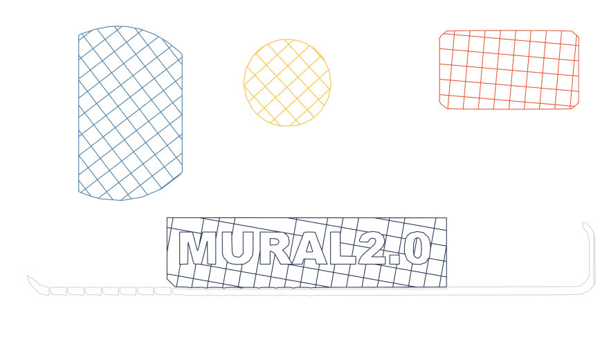

# Mark-making

How Mural 2.0 puts ink on paper: seven fill styles, tonal shading from one pen,
and multi-colour separation with pen swaps.

Every picture here is drawn from the real command file the machine would
execute, by `tools/make_style_examples.js`, so the strokes are the strokes the
pen makes. Regenerate them with:

```bash
node tools/make_style_examples.js                      # every style, test image
node tools/make_style_examples.js --mode grayscale --levels 4 --image path/to.jpg
node tools/make_style_examples.js --mode color --colors 6 --hue-grouping --image path/to.png
```

The test image comes from `tools/make_style_source.py`, and is built to exercise
the pipeline rather than to look nice: a smooth gradient for gradient hatch to
follow, flat colour for contour and spiral, a second ramp at another angle, thin
line work, and a wordmark knocked out of a shadowed band.

---

## The seven fill styles

The original cross-hatch plus six new ones, all on the same image at 400 × 229 mm
and infill density 3, so the numbers are comparable.


| | | |
|---|---|---|
| <br>**Cross-hatch** (default)<br><sub>Even 45° grid · 174 strokes · 10.9 m</sub> | <br>**Single-direction**<br><sub>One diagonal, ~⅔ the ink · 90 strokes · 7.1 m</sub> | <br>**Angled cross-hatch**<br><sub>Any angle; colour layers each get their own · 169 strokes · 10.8 m</sub> |
| <br>**Jittered**<br><sub>Hand-drawn wobble · 170 strokes · 10.8 m</sub> | <br>**Spiral**<br><sub>One continuous stroke per region · 91 strokes · 7.1 m</sub> | <br>**Contour**<br><sub>Rings following the shape's own outline · 33 strokes · 5.9 m</sub> |
| <br>**Gradient hatch**<br><sub>Follows the image's shading · 79 strokes · 5.6 m</sub> | | |

Note how thin gradient hatch looks here: it only marks where the image actually
has shading to follow, and most of this test image is flat colour. Give it
something with tone and it behaves completely differently.

### The right style for the subject

**Gradient hatch** wants continuous tone. On a shaded painting it stops being a
fill and starts being an engraving — the strokes follow the muscle rather than
crossing it, for *less* ink than the flat grid:

| | |
|---|---|
| <br><sub>Cross-hatch · 177 strokes · 11.3 m</sub> | <br><sub>Gradient hatch · 230 strokes · 7.6 m</sub> |

**Contour and spiral** want flat, clean-edged shapes, where following the outline
means something:

| | |
|---|---|
| <br><sub>Contour · 79 strokes · 9.4 m</sub> | <br><sub>Spiral · 166 strokes · 11.3 m</sub> |

### Tone and colour

**Grayscale (tonal)** traces nested luminance bands and hatches each at its own
density, so one pen renders shading. More levels means more separation and more
time:

| | | |
|---|---|---|
| <br><sub>Single colour · 177 strokes · 11.3 m</sub> | <br><sub>3 levels · 2,626 strokes · 30.3 m</sub> | <br><sub>4 levels · 2,876 strokes · 31.7 m</sub> |

**Multi-colour** separates the image into one mask per pen and stops for a swap
between them. It suits flat artwork, which is what k-means quantisation is good
at.

Every extra pen is a pen you have to own and a swap you have to stand around
for, so **hue grouping** is usually the setting you want: similar hues collapse
onto one pen, and the lighter shades of that hue are drawn as sparser hatching
instead of as separate inks. Two blues become one blue pen at two densities.

| | |
|---|---|
| <br><sub>**5 pens, no grouping** · 962 strokes · 33.7 m</sub> | <br><sub>**6 colours detected → 3 pens** · 2,934 strokes · 46.8 m</sub> |

Three pens carry it: one blue, one orange, one near-black. The tonal separation
that five pens spent ink on is done with hatch density instead — which is why
the grouped version reads more strongly despite using fewer inks. It costs more
ink and time, because rendering a tint as hatching means actually drawing it
rather than swapping to a paler pen.

A caveat worth knowing before you try it on the wrong thing. The wordmark image
looks like it should be perfect for five pens — five obvious hues — and it very
nearly is:



<sub>5 pens · 117 strokes · 6.9 m. Blue, yellow, red and navy all separate; the green ramp does not.</sub>

The green loses out to something that isn't a colour at all: the soft drop
shadow. 17% of that image's non-paper pixels are near-neutral grey and 84% of
those are the shadow, which is a large enough mass of tone to claim a pen on
merit. Asking for *more* pens makes it worse rather than better — at six, the
extra pens go to a second and third shade of grey and both the blue disc and the
green ramp drop out.

The same thing shows up in the Bluey renders as a faint ragged oval around the
family, which isn't obvious in the source: it's a soft blue halo that ramps from
invisible up to about 23% opacity. Compositing over white removes 99% of it, but
the denser inner part reaches a colour distance of 0.08 from paper — three times
further than a legitimately pale cream ink at 0.0255 — so no "too pale to draw"
rule can remove it without removing real content too. Anything with tone in it
gets drawn, because a pen has no way to draw 5% of a colour. Hue grouping handles
it more gracefully than flat separation does, rendering it as sparse hatching
rather than an outline.

So: flat art with distinct hues separates cleanly. Art with large soft shadows or
broad pale washes spends pens on tone, and hue grouping (above) is the better
tool for it.

Regenerate any of these with:

```bash
node tools/make_style_examples.js                      # every style, test image
node tools/make_style_examples.js --mode grayscale --levels 4 --image path/to.jpg
node tools/make_style_examples.js --mode color --colors 5 --image path/to.png
node tools/make_style_examples.js --mode color --colors 6 --hue-grouping --image path/to.png
```

The density ladder now reaches 2.5mm spacing (was 7mm), which is what makes true mid-tones possible rather than only light tints.
